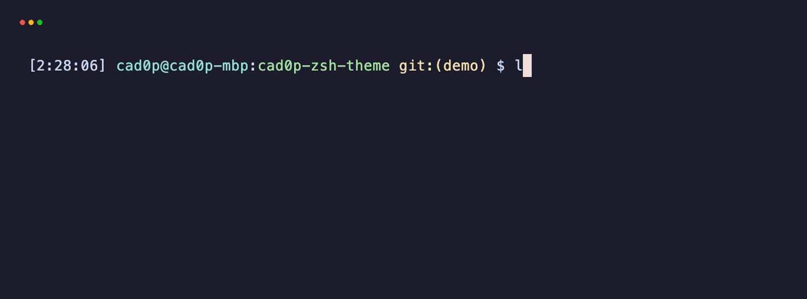

# cad0p.zsh-theme

A minimal [oh-my-zsh](https://github.com/ohmyzsh/ohmyzsh) theme — a one-line prompt with a 24-hour clock, `user@host`, the current directory, and git status.



[](https://github.com/cad0p/cad0p-zsh-theme/releases)
[](LICENSE)

## Features

- `[2:27:39]` — 24-hour clock with seconds
- `user@host` — always shown, in cyan
- current directory (basename) in green
- `git:(branch)` in yellow — dirty repos get a `*`
- `$` at the end, `#` for root

## Install

```zsh
curl -fsSL https://raw.githubusercontent.com/cad0p/cad0p-zsh-theme/main/cad0p.zsh-theme \
  -o "${ZSH_CUSTOM:-$HOME/.oh-my-zsh/custom}/themes/cad0p.zsh-theme"
```

Then set it in `~/.zshrc` and reload:

```zsh
ZSH_THEME="cad0p"
```

```zsh
source ~/.zshrc
```

## Credits

Based on the [`geoffgarside`](https://github.com/ohmyzsh/ohmyzsh/blob/master/themes/geoffgarside.zsh-theme) theme from oh-my-zsh, plus the hostname. Released under the [MIT License](LICENSE). The preview is generated with [vhs](https://github.com/charmbracelet/vhs) — see [`demo/`](demo/).
